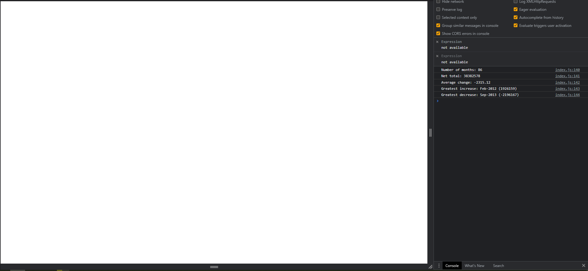

## Financial Analysis

This code contains an array of financial data representing profits and losses over a period of time. The following operations are performed on this data:

Calculate the total number of months
Calculate the net total amount of profit/losses over the entire period
Calculate the greatest increase in profits (date and amount)
Calculate the greatest decrease in losses (date and amount)
The results of these operations are printed to the console in a formatted manner.

# Usage
To use this code, simply open the index.html file in your browser and open the console. The financial analysis will be printed to the console.

# Licence

Open source, MIT.

# Screenshot

# Deployed Application Link 

https://davidhjolley.github.io/Console-Finances